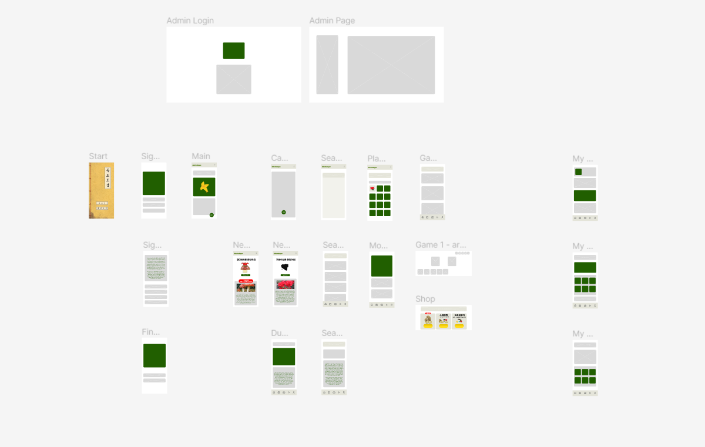
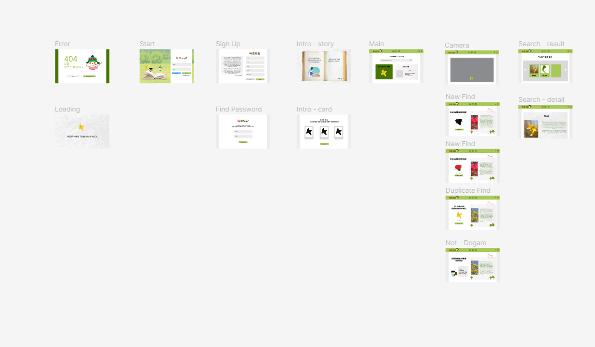
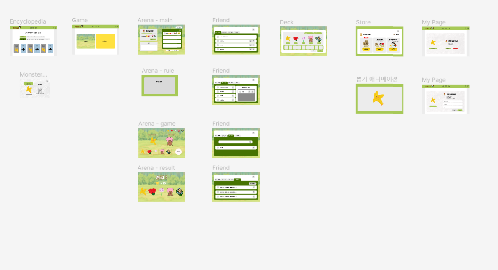
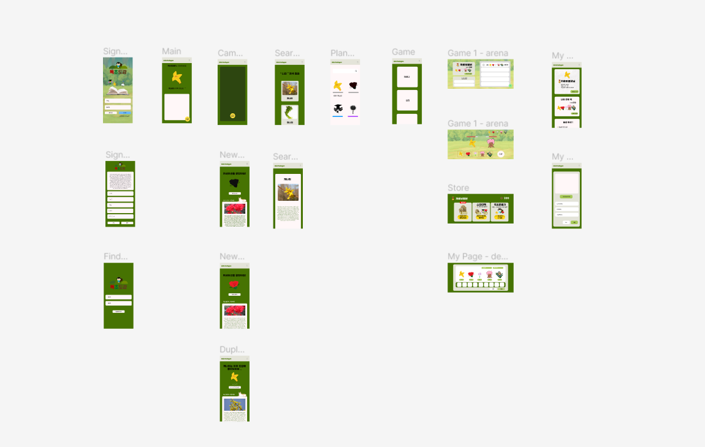

# 1. [와이어프레임](https://www.figma.com/file/WGMmsbI0axithfzPGdpSTP/%EB%8F%85%EC%B4%88%EB%8F%84%EA%B0%90?node-id=0%3A1)

프로젝트 시작 전 와이어프레임을 통해 레이아웃을 짰습니다.

# 2. [목업](https://www.figma.com/file/PsJBkcCkbAaZd6BxIVn5YC/%EB%8F%85%EC%B4%88%EB%8F%84%EA%B0%90-Mockup?node-id=0%3A1)

목업으로 상세하게 프로젝트의 방향을 잡았습니다.

